<div align="center">

# 🌍 Auditing Geographic Bias in AI-Driven ESG Scoring

### A SHAP-Based Explainability Analysis of Rating Disparities Between Global North and Global South Firms

[](https://www.python.org/)
[](https://jupyter.org/)
[](LICENSE)
[](https://aiml-conf.org/)
[](https://shap.readthedocs.io/)
[]()

**Submitted to the AIML 2026 Conference — Paris, France | October 26–27, 2026**

*Aarya Kulkarni · Aarya Patankar*

</div>

---

## 📌 Project Overview

This repository contains the full end-to-end research pipeline for our paper submitted to **AIML 2026**. The project investigates whether AI-based ESG (Environmental, Social, and Governance) scoring systems encode and perpetuate geographic bias against firms from the **Global South** — particularly those in Africa, Asia, Latin America, and the Middle East — relative to firms from the **Global North** (Europe, North America, Oceania).

We train three machine learning models on a globally representative corporate dataset, evaluate their predictive performance, and apply **SHAP (SHapley Additive exPlanations)** to audit which features — including geographic and market-type variables — drive model decisions. A dedicated fairness module disaggregates model outputs by region and market type, quantifying disparities through rigorous statistical testing.

---

## 💡 Research Motivation

ESG scores have become a dominant mechanism through which investors, regulators, and stakeholders assess corporate sustainability. However, the frameworks and data used to generate these scores are predominantly developed by Western rating agencies, calibrated to Western regulatory standards, and evaluated primarily on Global North firms.

This creates a structural risk: AI models trained on such scores may **learn, encode, and amplify** the geographic inequalities baked into the underlying data — not because the models are inherently biased, but because the input signals themselves carry historical and institutional disadvantage for Global South firms.

Understanding and auditing this bias is critical for:
- **Equitable capital allocation** — ensuring Global South firms are not systematically under-financed.
- **ESG policy design** — informing how rating agencies should adapt their methodologies for emerging markets.
- **AI accountability** — demonstrating how XAI tools like SHAP can serve as fairness auditing instruments.

---

## ❓ Research Question

> *Do AI-driven ESG scoring models exhibit geographic bias by systematically predicting lower scores or producing higher prediction errors for firms from the Global South compared to those from the Global North, and what features drive these disparities according to SHAP-based explainability?*

---

## ✨ Key Features

| Feature | Description |
|---|---|
| 🤖 **Multi-Model Prediction** | ESG score prediction using XGBoost, Random Forest, and LightGBM |
| 📊 **Model Benchmarking** | Side-by-side RMSE, MAE, and R² comparison across all three models |
| 🔍 **SHAP Explainability** | Global feature importance (beeswarm, bar), dependence plots for `CarbonEmissions` and `MarketCap` |
| ⚖️ **Geographic Fairness Evaluation** | ESG score and prediction error disaggregated by 7 regions and 2 market types |
| 📐 **Statistical Hypothesis Testing** | t-tests, Mann-Whitney U, and one-way ANOVA to validate disparities |
| 📈 **Publication-Quality Visualizations** | 13 figures exported as high-resolution PNGs ready for paper submission |
| 🧹 **End-to-End Data Pipeline** | From raw CSV ingestion to cleaned, feature-engineered model inputs |

---

## 🗂️ Repository Structure

```
aiml/
│
├── 📓 notebooks/                   # Jupyter notebooks — run in order 01 → 07
│   ├── 01_data_exploration.ipynb   # Dataset inspection, distributions, missing values
│   ├── 02_data_cleaning.ipynb      # Imputation, type casting, Market_Type engineering
│   ├── 03_feature_engineering.ipynb# One-hot encoding, preprocessor pipeline (saved to results/)
│   ├── 04_modeling_xgboost.ipynb   # XGBoost training, evaluation, feature importance
│   ├── 05_modeling_rf_lgbm.ipynb   # Random Forest and LightGBM training and comparison
│   ├── 06_shap_analysis.ipynb      # SHAP value computation, summary & dependence plots
│   └── 07_fairness_evaluation.ipynb# Fairness audit by region and market type
│
├── 📁 data/                        # Dataset files
│   ├── company_esg_financial_dataset.csv  # Raw dataset (11,000 firms × 16 features)
│   └── cleaned_esg.csv                    # Cleaned dataset (11,000 firms × 17 features)
│
├── 📁 results/                     # Model outputs and computed metrics
│   ├── model_comparison.csv        # RMSE, MAE, R² for all three models
│   ├── xgboost_model.pkl           # Trained XGBoost model (~917 KB)
│   ├── random_forest.pkl           # Trained Random Forest model (~216 MB)
│   ├── lightgbm.pkl                # Trained LightGBM model (~838 KB)
│   ├── preprocessor.pkl            # Fitted ColumnTransformer (encoder + scaler)
│   ├── shap_feature_importance.csv # Mean |SHAP| values for all 30 features
│   ├── fairness_metrics.csv        # Per-observation predictions and errors with group labels
│   ├── fairness_region.csv         # Region-level ESG score and error aggregates
│   ├── fairness_markettype.csv     # Market-type-level ESG score and error aggregates
│   ├── region_shap.csv             # Mean |SHAP| for each Region one-hot feature
│   ├── markettype_shap.csv         # Mean |SHAP| for each Market_Type one-hot feature
│   ├── missing_values_report.csv   # Missing value audit from cleaning stage
│   ├── xgboost_metrics.csv         # XGBoost-specific evaluation metrics
│   └── xgboost_predictions.csv     # Full prediction output from XGBoost
│
├── 📁 figures/                     # All generated visualizations (PNG)
│   ├── shap_summary.png            # SHAP beeswarm summary plot
│   ├── shap_bar.png                # SHAP global bar chart (mean |SHAP|)
│   ├── top10_shap_features.png     # Top 10 features bar chart
│   ├── shap_carbon.png             # SHAP dependence plot — CarbonEmissions
│   ├── shap_marketcap.png          # SHAP dependence plot — MarketCap
│   ├── esg_region.png              # Average ESG score by region
│   ├── esg_markettype.png          # Average ESG score by market type
│   ├── esg_boxplot.png             # ESG score distribution (boxplot)
│   ├── error_region.png            # Mean prediction error by region
│   ├── error_markettype.png        # Mean prediction error by market type
│   ├── rmse_comparison.png         # RMSE comparison across models
│   ├── r2_comparison.png           # R² comparison across models
│   └── xgboost_importance.png      # XGBoost native feature importance
│
├── 📁 paper/                       # Research paper writing drafts
│   ├── abstract_v1.md → v5.md      # Iterative abstract versions
│   ├── literature_review.md        # Background literature review draft
│   ├── methodology.md              # Methodology section draft
│   └── references.bib              # BibTeX bibliography
│
├── 📄 stat_analysis.py             # Standalone statistical testing script (scipy)
├── 📄 research_report.md           # Full research results report (10 sections)
├── 📄 requirements.txt             # Python dependencies
├── 📄 .gitignore                   # Git ignore rules
└── 📄 README.md                    # This file
```

---

## 🔄 Workflow

```
Raw Dataset (11,000 firms × 16 features)
           │
           ▼
  01 · Data Exploration
  Inspect distributions, missing values, class balance,
  regional and industry composition
           │
           ▼
  02 · Data Cleaning
  Impute 1,000 missing GrowthRate values,
  engineer Market_Type column → cleaned_esg.csv (17 features)
           │
           ▼
  03 · Feature Engineering
  One-hot encode Industry / Region / Market_Type,
  fit & save ColumnTransformer preprocessor
           │
           ▼
  04 · XGBoost Modeling
  Train, evaluate (RMSE / MAE / R²), save model + predictions
           │
           ▼
  05 · Random Forest & LightGBM Modeling
  Train both models, compare against XGBoost
           │
           ▼
  06 · SHAP Explainability
  Compute SHAP values on XGBoost, generate summary,
  bar, dependence plots → export CSVs + figures
           │
           ▼
  07 · Fairness Evaluation
  Disaggregate predictions by Region + Market_Type,
  compute per-group error and ESG gap metrics
           │
           ▼
  stat_analysis.py · Statistical Testing
  t-tests, Mann-Whitney U, one-way ANOVA
  on ESG scores and prediction errors
           │
           ▼
  📄 Research Paper (AIML 2026)
```

---

## 🛠️ Technologies Used

| Technology | Version | Role |
|---|---|---|
| **Python** | ≥ 3.10 | Core programming language |
| **Pandas** | ≥ 2.0.0 | Data manipulation and analysis |
| **NumPy** | ≥ 1.24.0 | Numerical computation |
| **Scikit-learn** | ≥ 1.3.0 | Preprocessing pipeline, evaluation metrics |
| **XGBoost** | ≥ 1.7.0 | Gradient boosted tree model #1 |
| **LightGBM** | ≥ 4.0.0 | Gradient boosted tree model #2 (best performer) |
| **SHAP** | ≥ 0.42.0 | Explainability — SHapley Additive exPlanations |
| **Matplotlib** | ≥ 3.7.0 | Visualization and figure generation |
| **Seaborn** | ≥ 0.12.0 | Statistical visualizations |
| **SciPy** | ≥ 1.11.0 | Statistical hypothesis testing |
| **Jupyter** | ≥ 1.0.0 | Interactive notebook environment |
| **openpyxl** | ≥ 3.1.0 | Excel file I/O support |

---

## 📦 Dataset

| Property | Value |
|---|---|
| **Raw file** | `data/company_esg_financial_dataset.csv` |
| **Cleaned file** | `data/cleaned_esg.csv` |
| **Observations** | 11,000 firms |
| **Raw features** | 16 |
| **Engineered features** | 17 (+ `Market_Type`) |
| **Time span** | 2015 – 2025 (1,000 records/year) |
| **Target variable** | `ESG_Overall` (continuous, range: 6.3 – 98.8) |
| **Target mean / SD** | 54.62 / 15.89 |

**Regions:** Africa · Asia · Europe · Latin America · Middle East · North America · Oceania

**Industries:** Healthcare · Transportation · Manufacturing · Consumer Goods · Finance · Energy · Utilities · Retail · Technology

**Market Types:** Developed (4,741 firms · 43.1%) · Emerging (6,259 firms · 56.9%)

### Preprocessing Steps

1. **Missing value imputation** — 1,000 missing `GrowthRate` records were identified and imputed
2. **Market_Type engineering** — derived column added to raw 16-feature dataset
3. **One-hot encoding** — `Industry`, `Region`, `Market_Type` encoded via `ColumnTransformer`
4. **Numeric passthrough** — all 11 numeric features passed through unchanged
5. **Preprocessor serialized** to `results/preprocessor.pkl` for reproducibility

---

## 🤖 Machine Learning Models

Three tree-based ensemble models were trained on the same 80/20 train-test split and evaluated on the same held-out set.

| Model | RMSE ↓ | MAE ↓ | R² ↑ | Model File |
|---|---|---|---|---|
| **LightGBM** ⭐ | **0.6229** | **0.4842** | **0.9984** | `results/lightgbm.pkl` (~838 KB) |
| XGBoost | 0.6535 | 0.5050 | 0.9982 | `results/xgboost_model.pkl` (~917 KB) |
| Random Forest | 0.7881 | 0.5926 | 0.9974 | `results/random_forest.pkl` (~216 MB) |

**⭐ Best Model: LightGBM** — achieves the lowest RMSE and MAE with the highest R², while producing the most compact model file. All three models achieve R² > 0.997, reflecting the strong compositional relationship between ESG sub-pillar scores and the overall target.

> **Note on model interpretation:** The near-perfect R² is structurally expected — `ESG_Environmental`, `ESG_Social`, and `ESG_Governance` are compositional inputs to `ESG_Overall`. SHAP analysis confirms these three features account for >99% of all predictive signal.

---

## 🔍 Explainable AI (SHAP)

SHAP values are computed on the **XGBoost model** using the `shap` library's `TreeExplainer`. The following visualizations are generated in `notebooks/06_shap_analysis.ipynb`:

### Global Feature Importance — Beeswarm Summary Plot

Each dot represents one test-set prediction. Position on the x-axis shows the direction and magnitude of impact on the model output. Color indicates the raw feature value (blue = low, red = high).

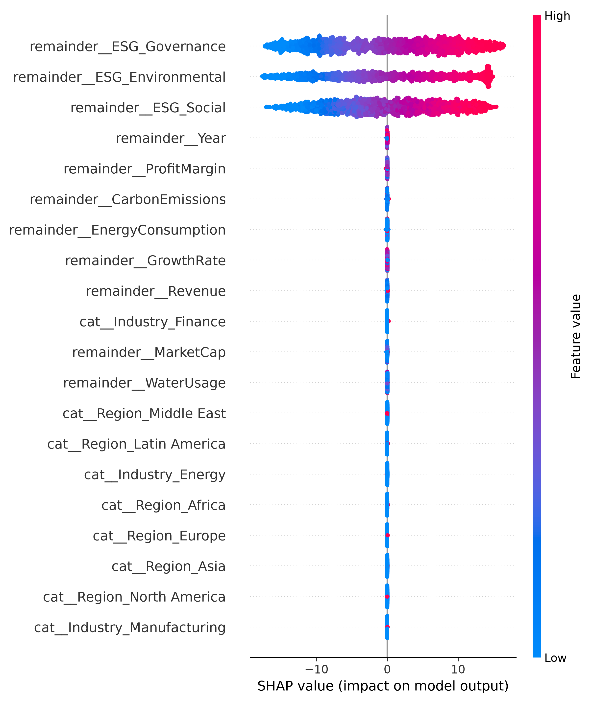

### Global Feature Importance — Bar Chart

Mean absolute SHAP values aggregated per feature. Provides a clean quantitative ranking for citation.

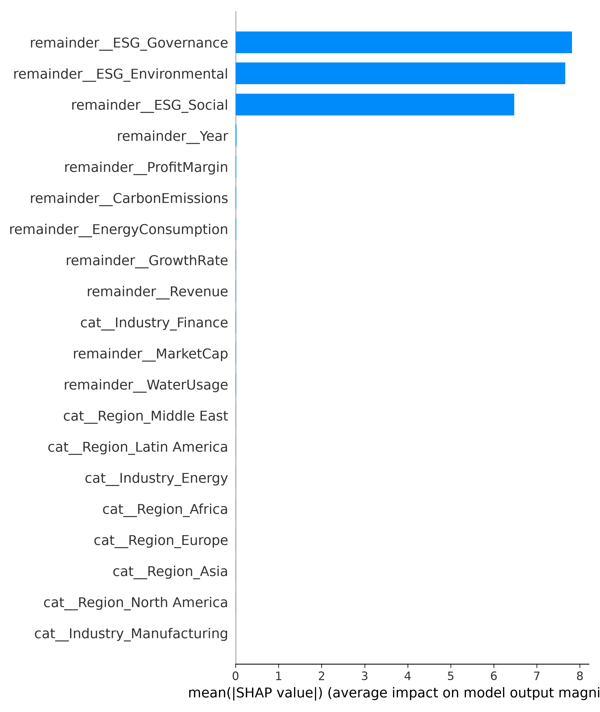

### Top 10 SHAP Features

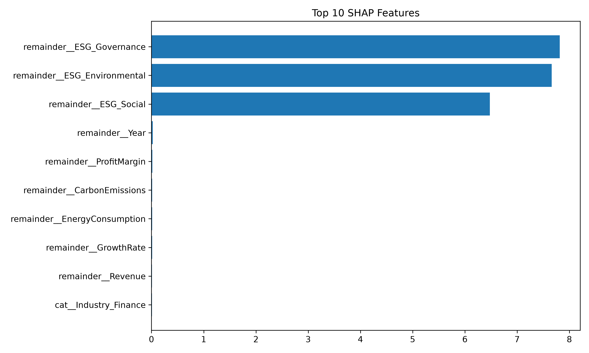

**Top 5 features by mean |SHAP|:**

| Rank | Feature | Mean \|SHAP\| |
|---|---|---|
| 1 | `ESG_Governance` | 7.8159 |
| 2 | `ESG_Environmental` | 7.6599 |
| 3 | `ESG_Social` | 6.4781 |
| 4 | `Year` | 0.0242 |
| 5 | `ProfitMargin` | 0.0152 |

The three ESG pillars are orders of magnitude more influential than all other features combined.

### Dependence Plot — Carbon Emissions

Examines the non-linear relationship between `CarbonEmissions` and its SHAP contribution, colored by `ESG_Environmental` score.

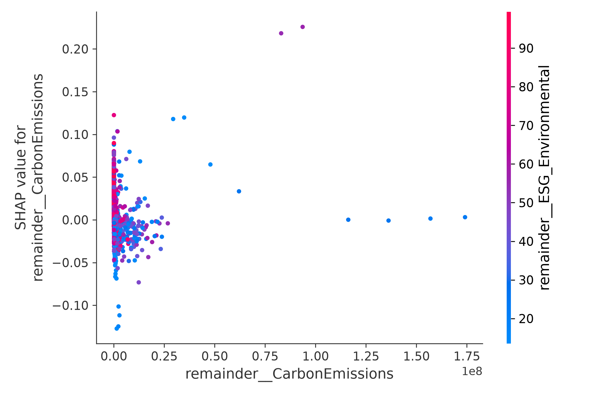

### Dependence Plot — Market Capitalization

Examines whether firm size (a geographic proxy) systematically influences ESG predictions.

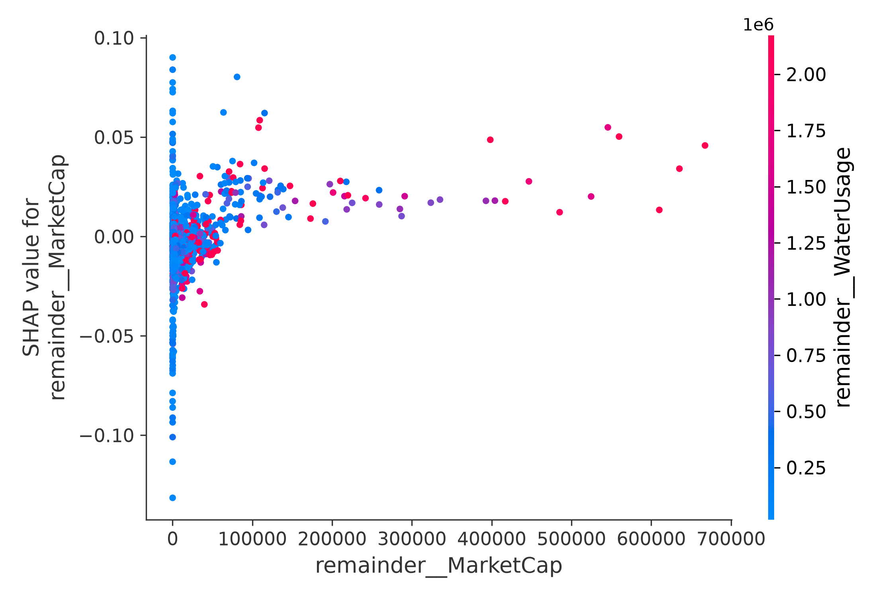

---

## ⚖️ Fairness Analysis

The fairness module (`notebooks/07_fairness_evaluation.ipynb` and `stat_analysis.py`) disaggregates model predictions along two demographic axes:

### Axis 1 — Market Type (Developed vs. Emerging)

| Market Type | Actual ESG (Mean) | Predicted ESG (Mean) | MAE |
|---|---|---|---|
| **Developed** | 62.90 | 62.91 | 0.4712 |
| **Emerging** | 47.95 | 48.02 | 0.4936 |

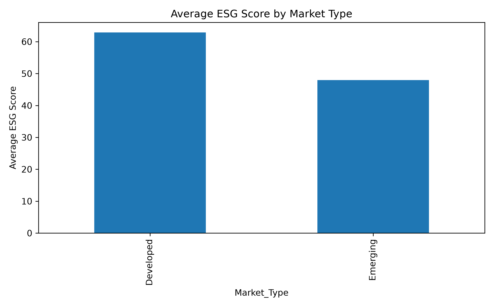
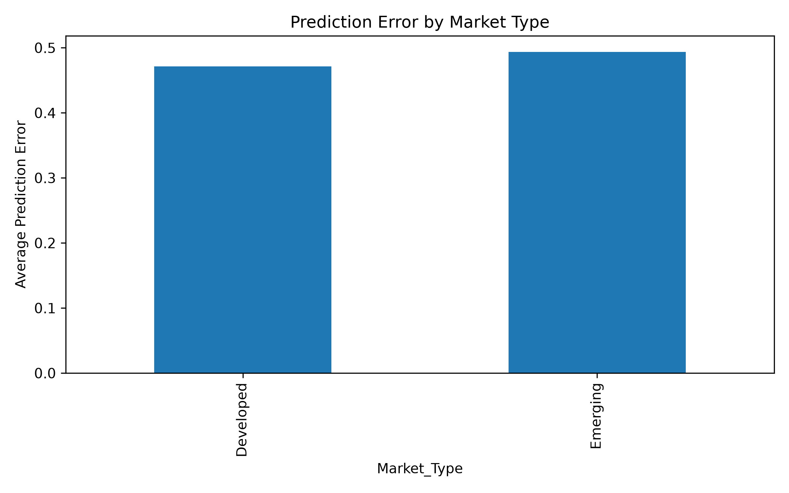

### Axis 2 — Geographic Region (7 Regions)

| Region | Actual ESG (Mean) | Mean Abs. Error |
|---|---|---|
| Europe | 66.58 | 0.5142 |
| North America | 61.16 | 0.4502 |
| Oceania | 61.08 | 0.4506 |
| Latin America | 51.33 | 0.4427 |
| Asia | 51.08 | 0.4928 |
| Africa | 45.75 | 0.5363 |
| Middle East | 43.65 | 0.5040 |

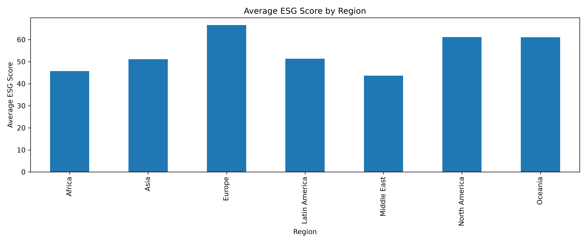
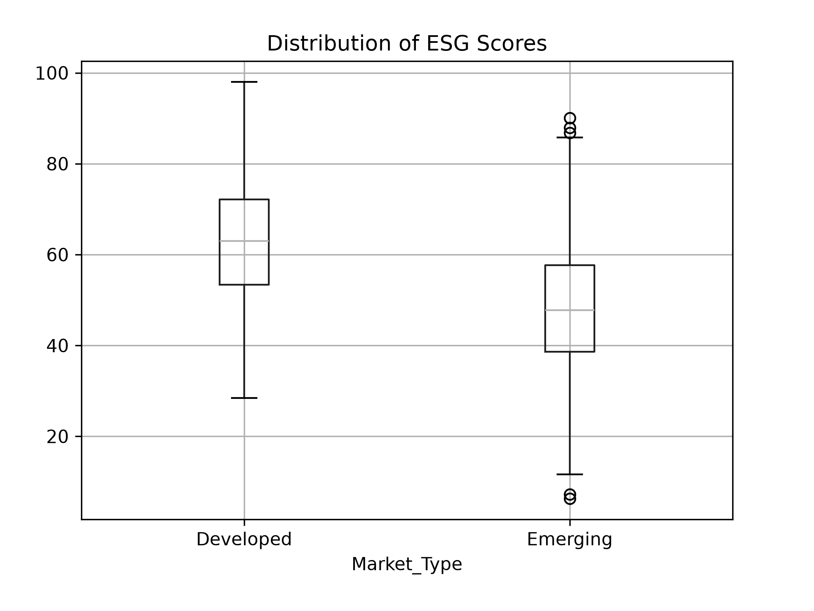
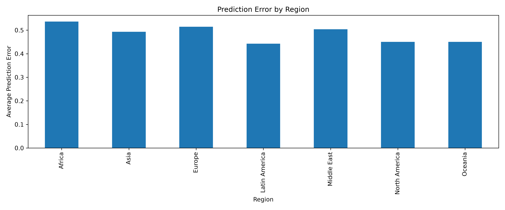

### Statistical Tests

| Test | Variables | Result | p-value |
|---|---|---|---|
| t-test | ESG: Developed vs. Emerging | **Significant** | < 0.0001 |
| Mann-Whitney U | ESG: Developed vs. Emerging | **Significant** | < 0.0001 |
| One-Way ANOVA | ESG across 7 Regions | **Significant** (F = 135.21) | < 0.0001 |
| t-test | Error: Developed vs. Emerging | Not significant | 0.185 |
| One-Way ANOVA | Error across 7 Regions | Marginally significant (F = 2.75) | 0.0115 |
| t-test | ESG: Global North vs. South | **Significant** | < 0.0001 |
| t-test | Error: Global North vs. South | Not significant | 0.185 |

---

## 📊 Results

### Key Findings

1. **LightGBM is the best-performing model** (RMSE = 0.6229, R² = 0.9984), outperforming both XGBoost and Random Forest on all three metrics.

2. **A 15-point ESG score gap exists between Developed and Emerging markets** — Developed: 62.90 vs. Emerging: 47.95 (statistically confirmed, p < 0.0001). The model faithfully reproduces this gap rather than correcting for it.

3. **Europe scores highest (66.58); Middle East lowest (43.65)** — a 23-point spread representing 1.45 standard deviations of the overall score distribution.

4. **ESG sub-pillar scores (Governance, Environmental, Social) account for >99% of SHAP explanation mass**, collectively dwarfing all geographic, financial, and operational features.

5. **No statistically significant geographic disparity in prediction accuracy** (p = 0.185). The model is equivalently accurate for Global North and Global South firms — however, it perpetuates the structural scoring inequality embedded in the data.

6. **Africa has the highest prediction error of any region (MAE = 0.5363)** — regional ANOVA is marginally significant (p = 0.0115), likely reflecting lower ESG disclosure quality and data sparsity.

7. **Global South regions have higher SHAP magnitudes for their regional indicators** than Global North regions, suggesting the model uses regional identity as a correction factor for unexplained variance.

8. **The model does not penalize high carbon emitters uniformly** — `CarbonEmissions` has a non-monotonic SHAP relationship, which may disadvantage industrializing economies disproportionately concentrated in the Global South.

### Model Performance Comparison

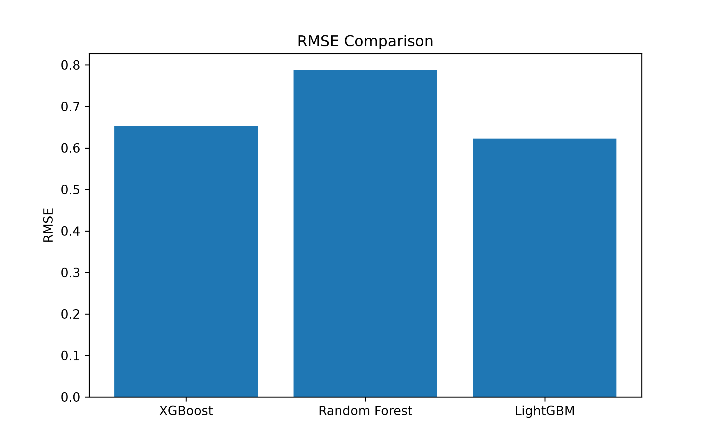
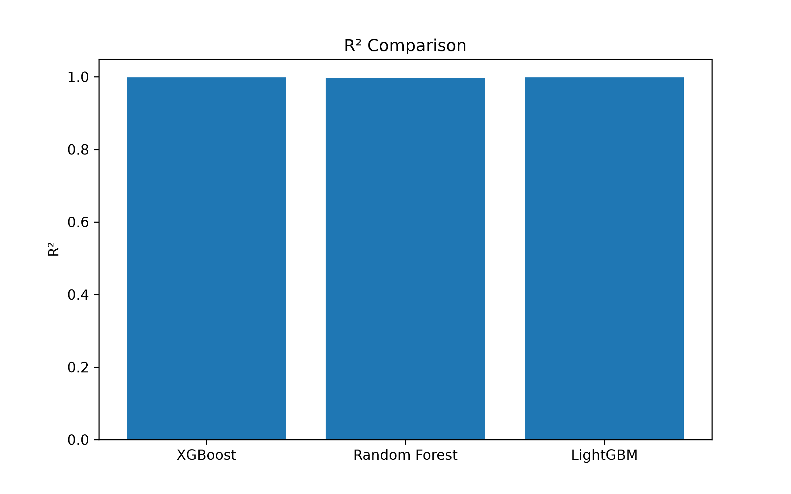

---

## 🖼️ All Figures

| Figure | File |
|---|---|
| SHAP Beeswarm Summary | `figures/shap_summary.png` |
| SHAP Global Bar Chart | `figures/shap_bar.png` |
| Top 10 SHAP Features | `figures/top10_shap_features.png` |
| SHAP Dependence — CarbonEmissions | `figures/shap_carbon.png` |
| SHAP Dependence — MarketCap | `figures/shap_marketcap.png` |
| Average ESG Score by Region | `figures/esg_region.png` |
| Average ESG Score by Market Type | `figures/esg_markettype.png` |
| ESG Score Distribution (Boxplot) | `figures/esg_boxplot.png` |
| Prediction Error by Region | `figures/error_region.png` |
| Prediction Error by Market Type | `figures/error_markettype.png` |
| RMSE Comparison | `figures/rmse_comparison.png` |
| R² Comparison | `figures/r2_comparison.png` |
| XGBoost Native Feature Importance | `figures/xgboost_importance.png` |

---

## 🚀 Installation

### 1. Clone the Repository

```bash
git clone https://github.com/aaryakulkarnii/aiml.git
cd aiml
```

### 2. Create and Activate a Virtual Environment

```bash
# Create virtual environment
python -m venv .venv

# Activate — Windows
.venv\Scripts\activate

# Activate — macOS / Linux
source .venv/bin/activate
```

### 3. Install Dependencies

```bash
pip install -r requirements.txt
```

### 4. Launch Jupyter

```bash
jupyter notebook
```

---

## 📖 Usage

Run the notebooks **in order** from `01` to `07`. Each notebook is self-contained and saves its outputs (models, CSVs, figures) to `results/` and `figures/` respectively, which are consumed by subsequent notebooks.

| Step | Notebook | Output |
|---|---|---|
| 1 | `01_data_exploration.ipynb` | EDA plots, distribution summaries |
| 2 | `02_data_cleaning.ipynb` | `data/cleaned_esg.csv`, `results/missing_values_report.csv` |
| 3 | `03_feature_engineering.ipynb` | `results/preprocessor.pkl` |
| 4 | `04_modeling_xgboost.ipynb` | `results/xgboost_model.pkl`, `results/xgboost_metrics.csv`, `figures/xgboost_importance.png` |
| 5 | `05_modeling_rf_lgbm.ipynb` | `results/random_forest.pkl`, `results/lightgbm.pkl`, `results/model_comparison.csv`, `figures/rmse_comparison.png`, `figures/r2_comparison.png` |
| 6 | `06_shap_analysis.ipynb` | `results/shap_feature_importance.csv`, all SHAP figures |
| 7 | `07_fairness_evaluation.ipynb` | `results/fairness_*.csv`, all fairness figures |

To run standalone statistical tests after completing the notebook pipeline:

```bash
python stat_analysis.py
```

---

## 🔭 Future Work

- **Sub-score ablation study** — re-train models excluding `ESG_Environmental`, `ESG_Social`, and `ESG_Governance` to test whether geographic bias becomes more pronounced when the model must predict from raw financial and environmental data alone.
- **Real-world ESG providers** — validate findings against commercial ESG ratings from MSCI, Sustainalytics, Refinitiv, or Bloomberg ESG Data.
- **Larger and more diverse datasets** — expand to cover more firms, particularly from underrepresented Global South markets with historically sparse ESG disclosure.
- **Deep learning models** — benchmark against TabNet or transformer-based tabular models to test if geographic bias is architecture-specific.
- **Causal fairness analysis** — apply counterfactual fairness frameworks (path-specific causal effects) to ask: would a firm's ESG score change if its geographic region were different, all else equal?
- **Cross-country validation** — replicate the fairness audit on country-level subsets to assess whether regional-level findings hold at a more granular geographic resolution.
- **Temporal disaggregation** — track whether the Developed/Emerging ESG gap has widened or narrowed between 2015 and 2025.
- **Fairness-constrained training** — apply Fairlearn or AIF360 to enforce geographic group parity and measure the accuracy-fairness trade-off.

---

## 📝 Citation

If you use this code, dataset, or findings in your work, please cite:

```bibtex
@inproceedings{kulkarni2026esgbias,
  title     = {Auditing Geographic Bias in AI-Driven ESG Scoring: A SHAP-Based
               Explainability Analysis of Rating Disparities Between Global
               North and Global South Firms},
  author    = {Kulkarni, Aarya and Patankar, Aarya},
  booktitle = {Proceedings of the International Conference on Artificial
               Intelligence and Machine Learning (AIML 2026)},
  year      = {2026},
  month     = {October},
  address   = {Paris, France},
  url       = {https://github.com/aaryakulkarnii/aiml}
}
```

---

## 👥 Authors

<table>
  <tr>
    <td align="center">
      <b>Aarya Kulkarni</b><br/>
      <i>Author</i><br/>
      <a href="https://github.com/aaryakulkarnii">@aaryakulkarnii</a>
    </td>
    <td align="center">
      <b>Aarya Patankar</b><br/>
      <i>Co-Author</i>
    </td>
  </tr>
</table>

---

## 📄 License

This project is licensed under the **MIT License** — see the [LICENSE](LICENSE) file for details.

```
MIT License

Copyright (c) 2026 Aarya Kulkarni, Aarya Patankar

Permission is hereby granted, free of charge, to any person obtaining a copy
of this software and associated documentation files (the "Software"), to deal
in the Software without restriction, including without limitation the rights
to use, copy, modify, merge, publish, distribute, sublicense, and/or sell
copies of the Software, and to permit persons to whom the Software is
furnished to do so, subject to the following conditions:

The above copyright notice and this permission notice shall be included in all
copies or substantial portions of the Software.

THE SOFTWARE IS PROVIDED "AS IS", WITHOUT WARRANTY OF ANY KIND, EXPRESS OR
IMPLIED, INCLUDING BUT NOT LIMITED TO THE WARRANTIES OF MERCHANTABILITY,
FITNESS FOR A PARTICULAR PURPOSE AND NONINFRINGEMENT. IN NO EVENT SHALL THE
AUTHORS OR COPYRIGHT HOLDERS BE LIABLE FOR ANY CLAIM, DAMAGES OR OTHER
LIABILITY, WHETHER IN AN ACTION OF CONTRACT, TORT OR OTHERWISE, ARISING FROM,
OUT OF OR IN CONNECTION WITH THE SOFTWARE OR THE USE OR OTHER DEALINGS IN THE
SOFTWARE.
```

---

<div align="center">

**AIML 2026 · Paris, France · October 26–27, 2026**

*Built with ❤️ for open and equitable AI research*

</div>
